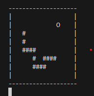

# SnakePy



"So cool, 10/10"  ~Metacwitic

Fun little project that I'll use as a quick refresher of basic python features. The game runs on Windows CMD if anyone ever decides to run it.
No external libraries are used, only standard libraries. Therefore, if you have python runtime engine ready and if it's already in your PATH 
environment variable then all you have to do is run this command:

```bat
cd snake-py
python main.py
```


*Also, Im disabling AI suggestions in VSCode that produce random snippets of code at times. I understand it can be useful
when time is of the essence and you treat is as "upgraded autofill" but for my use case it's more irritating than
it is helpful + it wouldn't be much of a "refresher" if AI would've written the whole thing for me :)*
